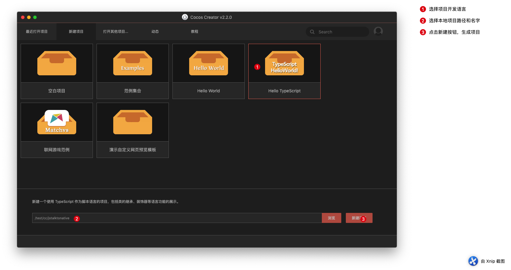

# Cocos Creator中JavaScript和Object-C 互相调用（Mac）
H5游戏做了许久，一直没怎么亲密接触过Native原生开发，之前接入SDK 也是用的JS版本，这些天开始用H5游戏，导出原生平台 Apk（安卓）和ipa（iOS）文件，不免用到了JavaScript和原生语言的调用，官方关于这块有两部分，一个是JSB2.0一个是原生的反射机制，由于开发时间有限，退而求其次，选择了反射机制。 

首先这里用Mac环境和Cocos Creator最新版本 2.2.0版本 语言使用 Typescript ，这个和js一样的，下面我将详细介绍如何从新建项目到相互调用成功。 原生导出 项目在 jstalktonative/build/jsb-link/frameworks/runtime-src/proj.ios_mac 下面

### 步骤一：环境支持

- Cocos Creator
- Typescript
- Xcode
- Webstorm（代码编辑器 可选）
- ios 下 需要自己有开发者账号 和证书

### 步骤二：流程

1. 首先我们打开我们的Cocos Creator 新建一个Typescript项目



1. 新建一个类 叫 JSTalkHelper.ts (名字自己随便起)


1. 挂载我们新建的脚本


1. 在场景里面 拖动几个按钮，好区分我们的几种方法


- 无参无返  ---> 没有参数，不返回值
- 无参有返  ---> 没有参数，有返回值
- 有参有返  ---> 有参数，有返回值
- 有参无返  ---> 有参数，无返回值
- 原生调用JS---> 原生调用 js 本例使用一个点击 触发，然后 Objective-c 使用 timer 主动调用

1. 我们操作之后，开始 构建项目  如果是安卓项目，必须配置对象的 SDK 和 NDK 


1. 使用 Xcode 打开我们的项目

   

1. 在 AppController.mm 文件 添加我们的调用代码

完整代码如下  我对 Objective C 不是很熟悉 写的最简单的 熟悉的可以自己按照最好的语法格式书写

```bash
JS: 点击了 '无参无返' 按钮，开始调用
2019-11-02 15:24:54.807695+0800 jstalknative-mobile[9058:251859] OC收到：无参数，无返回值
JS: 点击了 '无参有返' 按钮，开始调用
2019-11-02 15:24:56.726084+0800 jstalknative-mobile[9058:251859] OC收到：有参数，有返回值 返回值：2000
JS: 返回值 2000
JS: 点击了 '有参有返' 按钮，开始调用
2019-11-02 15:24:58.406802+0800 jstalknative-mobile[9058:251859] OC收到：有参数，有返回值 cocos10086 和 18 返回值：hello
JS: 返回值 hello
JS: 点击了 '有参无返' 按钮，开始调用
2019-11-02 15:24:59.356885+0800 jstalknative-mobile[9058:251859] OC收到：有参数，无返回值 cocos10086 和 18
JS: 无 返回值
JS: 点击了 'OC 主动调用' 按钮，1秒后开始
2019-11-02 15:25:00.306419+0800 jstalknative-mobile[9058:251859] OC收到： 1 秒后 调用JS
JS: 返回值 undefined
2019-11-02 15:25:01.320414+0800 jstalknative-mobile[9058:251859] 时间到触发
JS: JS 成功返回 输出 "you are niu B"
2019-11-02 15:25:01.321842+0800 jstalknative-mobile[9058:251859] jsCallStr = timerTestJSCallBck("you are niu B");
```

### 参考

- Cocos Creator iOS 互相调用看我的就够了](https://www.jianshu.com/p/b92d63b2a773) -简书
- [Cocos creator ios开发—Javascript和Objective-C交互](https://www.jianshu.com/p/116826d2570c) -简书

总的来讲，这次技术摸索了很久，特别是原生的语法格式，函数调用，中间也查阅了很多API 和文档，也向公司内同事请教了很多问题，最终算是简单实现了，相互调用。